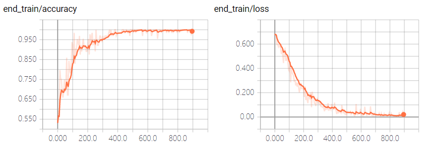

# 第三问：文本完整性判断模型构建

## 模型流程图

模型流程图如下:

​	

<div align="center">模型流程图</div>

## 数据预处理

​		对所给的数据随机抽取300条，进行三段划分，并根据每段文划分情况标注序号。构建首段数据集时，抽取各个文本首段内容并将其标签设定为1，在文本抽取2或3段并设定标签为0，去除文本中无用符号后，整合形成首段数据集，对于尾部数据集处理采取相同生成措施。将数据集以7:2:1进行截取，分别作为train, val, test三个阶段的数据。

```python
def data_preprocess():
    # 数据预处理函数
    lines = open(filename1,"r",encoding="utf-8-sig").readlines()
    f1 = open(test_dir,"w",encoding="utf-8-sig")
    for line in lines:
        str = "".join(line.split())+"\n"
        f1.write(str)
    f1.close()

```

## 模型构建

​	在第一题的TextCNN的基础上，我们修改分类标签为["0","1"]，将多分类问题转化为二分类问题，将数据替换为新的数据。在文件夹**./model_generate/begin_judge/**  与**./model_generate/end_judge/**，在命令行调用指令:

>  python run_cnn train

便可以产生相应的首位与尾部模型，在命令行调用指令：

> python run_cnn test

可以查看对测试集数据的分类情况的准确度与损失函数。


<div align="center">首部模型准确率与损失函数</div>



<div align="center">尾部模型准确率与损失函数</div>

​		

​		将我们需要判断的数据放置在**./data/** 文件夹下，命名predict.txt。然后再命令行调用指令

> python main

便能获得首尾部评价分数，将首位部评分求和获得最终输出分数。

​		构建首尾部模型完毕后，在main文件中，通过首尾部模型对输入文本的首部与尾部分别进行识别，获取首部分数bs与尾部分数es求和获得最终结果score。在模型输入的过程中，我们需要对输入的数据进行截断处理。在首部识别模型，我们需要截取数据各个文本头20字作为输入数据。在尾部识别模型中，我们取输入数据尾部20字为输入数据。数据处理代码如下：

``` python
def begin_process_file(filename, word_to_id, cat_to_id, max_length=600):
    lines = open(filename,"r",encoding="utf-8-sig").readlines()
    f1 = open("tmp.txt","w",encoding="utf-8")
    string = []
    for line in lines:
        if(len(line)<20):
            str = "0\t"+line
        else:
            str = "0\t"+line[:20]+"\n"
        f1.write(str)
    f1.close()
	# ...后续代码省略

def end_process_file(filename, word_to_id, cat_to_id, max_length=600):
    lines = open(filename,"r",encoding="utf-8-sig").readlines()
    f1 = open("tmp.txt","w",encoding="utf-8")
    string = []
    for line in lines:
        if(len(line)<20):
            str = "0\t"+line
        else:
            str = "0\t"+line[-20:]
        f1.write(str)
    f1.close()

	# ...后续代码省略
```


## 数据可视化

​		在获得最终分数之后，我们调用matplotlib库,将我们获得的最后数据score绘制成为饼状图输出。


<div align="center">完整性饼状图</div>


饼状图代码如下

```python
def draw_pie_chart(score):
    # 绘制饼状图
    plt.rcParams['font.sans-serif']=['SimHei'] # 解决中文乱码问题
    great =0
    fine = 0
    bad = 0
    for d in score:
        if d==2:
            great = great+1
        elif d==1:
            fine = fine+1
        else:
            bad = bad+1
    plt.figure(figsize=(6,9))
    labels = ['很完整','比较完整','不完整']
    colors = ['lightskyblue','yellowgreen','red']
    values = [great,fine,bad]
#    plt.title("文本完整性评分饼状图",fontsize=25)
    plt.pie(
            values,
            explode=(0.02,0,0),
            labels=labels,
            colors=colors,
            startangle = 90,
            shadow=False,
            autopct='%3.2f%%',
            pctdistance = 0.6
            )
    plt.axis('equal')
    plt.legend()
    plt.savefig('../pic/完整性饼状图.png')
    plt.show()
```

